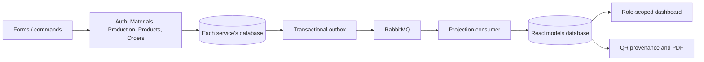

# Messaging, CQRS and public QR access

## Running the application

```powershell
docker compose up -d --build
```

The five domain services own their existing write databases. `read-models-service`
owns `read-models-db` and serves the dashboard query and the provenance projection.
The existing product endpoint and PDF renderer consume that provenance projection.



## Events and guarantees

Every INSERT, UPDATE and DELETE on the following tables writes a snapshot to
`integration_outbox` in the **same PostgreSQL transaction**. Database triggers
cover all write paths, including quantity adjustments and cascaded deletes.

| Publisher | Projected entities |
|---|---|
| auth | farms, users (only ID, role and farm assignment) |
| raw-materials | raw_materials |
| productions | production_batches, process_steps, batch_raw_materials |
| products | products |
| orders | orders, order_items |

Event envelope: `schema_version`, `source`, `sequence`, `entity_type`, `entity_id`,
`operation`, `data`. Routing keys have the form `source.entity_type.operation`,
for example `products.products.insert`. These are versioned integration snapshots,
not an event-sourced replacement for the domain database.

- AMQP 0-9-1 with publisher confirms and mandatory routing.
- Durable topic exchange `local_bite.events.v1`, persistent messages and durable
  queue `local_bite.read_models.v1`. RabbitMQ uses a named volume and stable hostname.
- Mark an outbox record published only after the broker confirms acceptance and routing.
- A broker outage does not roll back a successful business write. The relay retries.
- The consumer commits the projection and receipt before acknowledging delivery.
- `(source, sequence)` identifies duplicate deliveries. Per-entity sequence checks
  reject stale snapshots; deletion tombstones prevent resurrection by older messages.
- Unsupported/malformed envelopes go to `local_bite.read_models.dead.v1` for inspection.
- Delivery is **at least once**; projection application is idempotent.

The migration seeds events for existing data, so existing products and farms are
included. Password hashes, private user profiles and order contact information are
excluded from event payloads. Public provenance contains only the product, producer
name, production steps and materials; dashboard queries enforce JWT role and scope.

## Consistency

Dashboard refreshes every five seconds. The query model is eventually consistent:
it can lag while messages are in flight or the broker is unavailable. The query API
returns `asOf`, the latest projection processing timestamp (not a guarantee that all
publishers have caught up). A newly created product can temporarily return HTTP 409;
the scan page retries and offers a retry button.

Product visibility and QR validity are still checked immediately by products-service.
Only that service and read-models-service are needed for QR reads; farm, materials
and production services are not contacted on the query path.

Inventory validation/deduction and batch ownership validation remain synchronous.
They determine whether a command succeeds and must not depend on a delayed projection.
Material origin and dates on production records remain snapshots from when materials
were added, even when current inventory data is edited later.

## Recovery and monitoring

- `GET /health/queries`: query service health and consumer connection state.
- RabbitMQ Management on local port 15672: queue depth and dead-letter queue.
- Each source DB: `SELECT count(*) FROM integration_outbox WHERE published_at IS NULL;`.
- Published outbox rows and projection receipts are retained for replay/audit. They
  require a retention policy before long-running production use.
- After restoring/recreating the read database, run `scripts/Replay-Events.ps1`.
  Replaying is safe against an existing read model and does not edit business data.
- Version 1 uses one projection queue. A new independent consumer must get its own
  durable queue/binding so consumers do not compete for the same delivery.

## QR codes on phones

```powershell
./scripts/Start-PublicQr.ps1 -Build
```

This starts a static public frontend and Cloudflare Quick Tunnel, captures the HTTPS
hostname, updates `PUBLIC_TRACE_URL`, and recreates products-service. Opening or
downloading a product QR again regenerates the image for the new URL.

The public gateway permits only the `/trace/<token>` screen, its JS/CSS assets and
read-only `/api/products/public/<token>` / `certificate.pdf` endpoints. Login,
administration, query internals, source maps and write endpoints are not exposed.
The local gateway check is available only on `127.0.0.1:8081`.

The computer, Docker and tunnel must stay running. A Quick Tunnel URL is temporary
and can change when the tunnel restarts. Rerun the script to synchronize the URL,
then download new QR images. Already printed QR codes keep their original URL.
For permanent labels, use a named tunnel and stable domain with the same restricted
gateway, then set `PUBLIC_TRACE_URL=https://<your-host>/trace` and recreate products-service.

Stop public access:

```powershell
docker compose -f docker-compose.yml -f docker-compose.public.yml stop public-tunnel public-gateway
```

## Regression checks

```powershell
node scripts/verify-farm-trace.cjs
node scripts/verify-role-stock.cjs
node scripts/verify-cqrs.cjs
```

The CQRS test briefly stops RabbitMQ and three source services, restores them, and
removes its disposable business data. It checks rollback, duplicate and out-of-order
deliveries, backlog recovery, customer/farm scope and reads without producer services.
Run it against the local development stack only.
