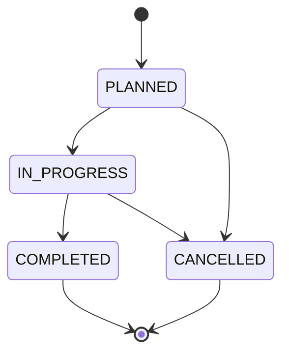
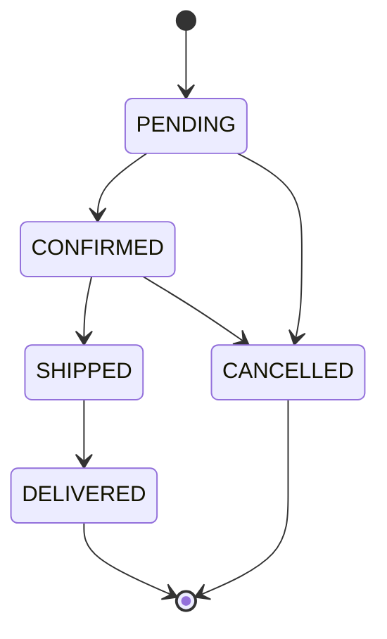

# 01 — Domen i funkcionalnosti

[Sadržaj specifikacije](README.md)

## 1. Poslovni problem i svrha

Mala gazdinstva vode evidenciju sirovina, prerade i prodaje u razdvojenim zapisima. Bez zajedničkog identifikatora proizvoda i njegove proizvodne serije teško je utvrditi koje su sirovine utrošene, koliko proizvoda je nastalo i šta kupac može da sazna o poreklu. Local Bite povezuje ove evidencije u jedinstven poslovni tok.

Sistem je generički u smislu da sirovina i proizvod imaju naziv, tip i jedinicu mere, a proizvodni proces ima naziv, vrstu i uređene korake. Ne postoji posebna tabela za svaku namirnicu. Ipak, generičnost nije neograničena: završavanje proizvodnje validira konačan skup tipova i jedinica.

## 2. Akteri

| Akter | Identifikator u JWT-u | Poslovna uloga |
|---|---|---|
| Posetilac | Nema JWT | Otvara javni QR prikaz i PDF |
| Kupac | `CUSTOMER` | Pregleda ponudu, filtrira proizvođače, kreira i prati svoje porudžbine |
| Vlasnik | `BUSINESS_OWNER` | Kreira gazdinstvo, dodaje radnike, upravlja zalihama, proizvodnjom, proizvodima i porudžbinama |
| Radnik | `WORKER` | Obavlja operativne izmene sirovina, proizvodnje i proizvoda; ažurira dozvoljene statuse porudžbina |
| Administrator | `SYSTEM_ADMIN` | Pojedini globalni pregledi; administrativna podrška je neujednačena po endpointima |
| Interni čitalac porekla | `TRACEABILITY` | Kratkotrajni tehnički JWT, ograničen na gazdinstvo i konkretan ID |

Frontend korisnički model koristi `BusinessOwner`, `Worker`, `Customer`, `SystemAdmin`, dok JWT koristi velika slova sa donjim crtama. `TRACEABILITY` nije nalog krajnjeg korisnika.

## 3. Katalog funkcionalnih zahteva

| ID | Funkcionalnost | Konkretno ponašanje |
|---|---|---|
| F-01 | Registracija | Email, lozinka i obavezni profil; Argon2 hash; JWT u odgovoru |
| F-02 | Prijava i sesija | Provera lozinke, JWT od jednog sata, `/me` vraća profil i osveženi token |
| F-03 | Profil | Pregled i promena sopstvenih podataka; brisanje naloga uz ograničenja uloge |
| F-04 | Gazdinstvo | Kreiranje za vlasnika, povezivanje korisnika, novi token sa `business_id`, izmena i brisanje |
| F-05 | Zaposleni | Vlasnik dodaje novog korisnika kao radnika svog gazdinstva i pregleda radnike |
| F-06 | Sirovine | Unos, pregled, pretraga, filtriranje po tipu, izmena i logičko brisanje |
| F-07 | Stanje sirovina | Korekcija količine, prag niske zalihe i pregled zaliha ispod praga |
| F-08 | Proizvodne serije | Planiranje, pregled i promena statusa serije uz pripadnost gazdinstvu |
| F-09 | Utrošak sirovina | Povezivanje sirovine sa serijom, skidanje sa stanja i istorijski snimak podataka |
| F-10 | Koraci procesa | Uređeni koraci sa opisom, trajanjem i temperaturom |
| F-11 | Završetak proizvodnje | Obavezan naziv/tip/jedinica/količina izlaza; događaj pokreće nastanak proizvoda |
| F-12 | Skladište | Neaktivni gotovi proizvodi, početna cena 0, povezani sa proizvodnom serijom |
| F-13 | Prodajna ponuda | Pozitivna cena i završena serija pre aktiviranja; odvajanje skladišta i ponude |
| F-14 | Slike | Upload slike proizvoda, obrada u JPEG i prikaz kroz HTTP |
| F-15 | QR | PNG sa URL-om javne stranice; generisanje na zahtev i obnova fajla |
| F-16 | Poreklo | Proizvod, naziv gazdinstva, serija, koraci i istorijski podaci sirovina iz projekcije |
| F-17 | PDF | Dokument porekla generisan na osnovu trenutnog javnog prikaza podataka |
| F-18 | Poručivanje | Kupac bira proizvode; jedan zahtev može napraviti po jednu porudžbinu za svako gazdinstvo |
| F-19 | Obrada porudžbine | Kontrolisani prelazi statusa, otkazivanje i ograničeno logičko brisanje |
| F-20 | Analitika | Prihod isporučenih porudžbina, broj porudžbina, statusi, mesečni prihod i najprodavaniji proizvodi |
| F-21 | Dashboard | Posebni podaci za kupca, radnika, vlasnika i administratora; periodično osvežavanje |
| F-22 | Katalog proizvođača | Autentifikovani pregled ID-a i naziva gazdinstava za filtere |
| F-23 | Pouzdano objavljivanje promena | Transakcioni outbox, potvrde brokera, ponavljanje i deduplikacija projekcija |
| F-24 | Oporavak projekcija | Ponovno slanje sačuvanih događaja preko PowerShell skripte |

Prisustvo funkcionalnosti nije garancija da su svi granični slučajevi zatvoreni. Posebno proveriti ograničenja F-01, F-09, F-18 i F-19 u dokumentu 10.

## 4. Glavni slučajevi korišćenja

### UC-01 — Otvaranje gazdinstva

Preduslov: korisnik ima ulogu vlasnika. Vlasnik šalje naziv i adresu, sa opcionim telefonom, opisom i sajtom. Auth proverava da li taj vlasnik već ima gazdinstvo, upisuje ga, ažurira `users.business_id` i izdaje novi token. Frontend čuva token, a osvežavanjem profila usklađuje podatke sesije.

Ishod: naredne komande dobijaju `business_id` iz tokena. Kreiranje firme zaključava korisnika i u jednoj transakciji upisuje firmu i dodeljuje vlasnika; paralelni drugi pokušaj dobija konflikt.

### UC-02 — Evidentiranje i potrošnja sirovine

Vlasnik ili radnik unosi naziv, tip, količinu i jedinicu, opciono poreklo, dobavljača i datume. Proizvodna serija pri dodavanju sirovine preuzima njen snimak. Sirovine servis proverava dovoljan saldo i istu jedinicu, pa atomskom SQL izmenom skida količinu. Operacija ima UUID koji omogućava bezbedno ponavljanje istog zahteva.

Ishod: stanje sirovine je umanjeno, a serija čuva koliko i kakve sirovine je koristila. Naknadna promena porekla ili datuma sirovine ne prepisuje raniji snimak u seriji. Uklanjanje veze sirovine iz serije u aktuelnom kodu ne vraća količinu automatski.

### UC-03 — Od proizvodnje do skladišta

Serija se kreira kao `PLANNED`, zatim prelazi u `IN_PROGRESS`. Pri završavanju zahtev mora da sadrži `output_name`, `output_type`, `output_unit` i pozitivnu konačnu `output_quantity`. Rok trajanja izlaza je opcion, ali ako postoji ne sme biti pre kraja proizvodnje.

Izmena serije i outbox događaj nastaju u lokalnoj transakciji. Products consumer prima događaj i kreira neaktivan proizvod sa cenom 0. `production_outputs.batch_id` i zaključavanje sprečavaju da redelivery iste završene serije napravi drugu zalihu. Skladište se zato osvežava periodično: HTTP završetak serije ne znači da je proizvod već vidljiv u narednoj milisekundi.

### UC-04 — Stavljanje proizvoda u prodaju

Vlasnik ili radnik uređuje proizvod iz skladišta. Aktiviranje zahteva pozitivnu cenu i sinhronu potvrdu da je vezana serija završena i pripada gazdinstvu. Za automatski nastali proizvod nije dozvoljena promena izmerene količine, jedinice ni proizvodne serije kroz običnu izmenu proizvoda. Prodaja atomarno rezerviše raspoloživu količinu preko internog tehnički autorizovanog ugovora.

### UC-05 — Poručivanje iz više gazdinstava

Kupac šalje stavke sa `product_id` i količinom. Orders učitava profil iz auth servisa i trenutne proizvode iz products servisa, proverava aktivnost i zalihu, preuzima nazive i cene, grupiše stavke po gazdinstvu i u jednoj orders transakciji upisuje sve porudžbine i stavke. Nakon commit-a zasebnim REST pozivima umanjuje proizvode.

Ishod je niz porudžbina. Cena stavke ostaje snimak pri poručivanju. Zaliha se rezerviše atomarno pre kreiranja porudžbina. Trajna namera i idempotency ključ omogućavaju oporavak, a otkazivanje vraća rezervisanu količinu preko trajnog release posla. Nije implementirano plaćanje karticom, naplata ili integracija kurirske službe.

### UC-06 — Skeniranje porekla

Posetilac skenira QR i otvara `/trace/:qrToken`. Browser zove javni products API. Products proverava token, aktivnost i logičko brisanje u svojoj bazi, kao i lokalno projektovano stanje proizvodnje. Read-model servis vraća lanac porekla uz interni token. Posetilac vidi sažet prikaz i može da otvori PDF bez registracije.

Nepostojeći ili neaktivan proizvod daje 404. Nedostajuća projekcija proizvoda ili nepodudaranje reference serije može dati 409. Frontend za 409 pokušava još četiri puta, sa razmakom od jedne sekunde; posle neuspeha nudi ručni ponovni pokušaj. Nedostajuća projekcija firme ili serije može biti prikazana kao nepotpuna informacija, ne mora uvek dati 409.

## 5. Životni ciklusi

Završena serija ne prihvata izmene kroz `BatchService.update`. Brisanje je zabranjeno za `IN_PROGRESS` i `COMPLETED`. To ne znači da su svi njeni podaci nepromenljivi: izmena/brisanje koraka nema istu statusnu zaštitu.

Samo vlasnik može da zatraži `CANCELLED`. Logičko brisanje porudžbine dozvoljeno je samo za `PENDING` i `CANCELLED`. Otkazivanje ne vraća zalihu u trenutnoj implementaciji.

## 6. Pravila merenja i vremena

- Sirovinska potrošnja je najmanje 0,001 i ima najviše tri decimale; nema automatske konverzije kg↔g ili l↔ml.
- Jedinica potrošnje mora odgovarati jedinici sirovine; poređenje je tekstualno.
- Datum isteka sirovine ne sme prethoditi evidentiranom datumu berbe/proizvodnje ni prijema.
- Datum kraja serije ne sme prethoditi početku. Pri pokretanju/završavanju mogu se dopuniti današnjim UTC datumom.
- Završavanje prihvata tipove `meat`,`meat_products`,`dairy`,`eggs`,`fish`,`vegetable`,`fruit`,`grain`,`legume`,`nuts_seeds`,`bakery`,`honey`,`oils`,`preserves`,`beverages`,`herbs_spices`,`other` i jedinice `kg`, `g`, `l`, `ml`, `pcs`. Oznake `cheese` i `sausage` ostaju podržane za postojeće zapise; za nove se koriste `dairy` i `meat_products`.
- Ne postoji proračun očekivanog prinosa, normativ, automatski otpis ili obavezna jednakost ulazne i izlazne mase.
- Evidentiran rok trajanja isključuje proizvod iz efektivno aktivne ponude i rezervacije nakon isteka.

## 7. Granice obuhvata

Nisu implementirani AI prognoziranje, elektronsko plaćanje, fakturisanje, integracije dostave, email/SMS obaveštenja, hardverski senzori, mobilna aplikacija, offline sinhronizacija ili digitalno potpisivanje sertifikata. PDF je zapis podataka unetih od proizvođača, bez dokaza nezavisne verifikacije tih podataka.

Primarni izvori: `services/*/src/handlers`, `services/*/src/services`, `services/auth/src/service`, `services/raw-materials/src/service`, `frontend/local-bite-frontend/src/app/features`.
