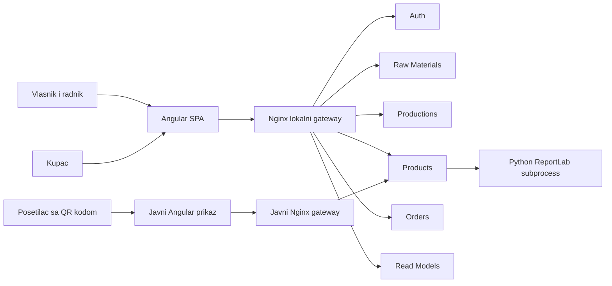
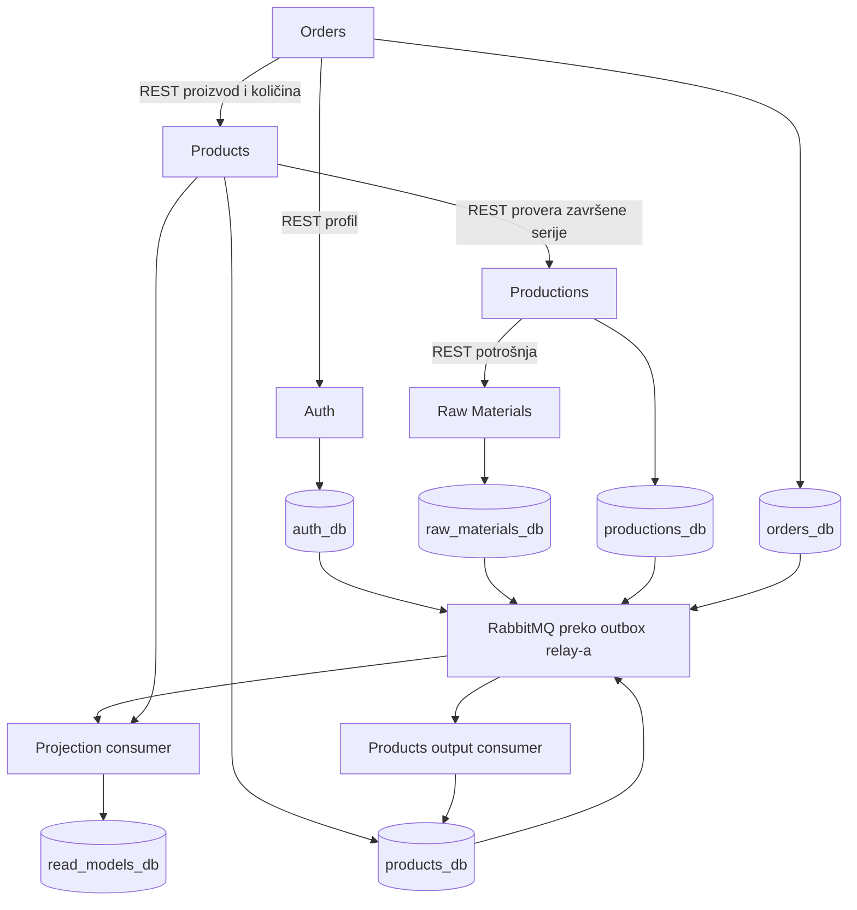
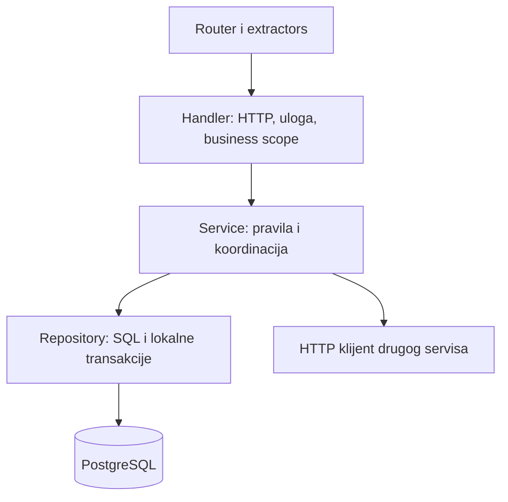

# 03 — Arhitektura sistema

[Sadržaj specifikacije](README.md)

## 1. Arhitektonski stil

Local Bite je mikroservisna aplikacija organizovana u monorepozitorijumu. Razdvojeni izvršni procesi i baze predstavljaju granice servisa; monorepo i zajednički build ne pretvaraju ih u jedan monolit. Istovremeno, zajednička biblioteka, zajednički JWT secret i Dockerfile-ovi koji kompajliraju ceo workspace stvaraju određenu razvojnu i operativnu povezanost.

Backend je Cargo workspace u glavnom repozitorijumu, dok `.gitmodules` evidentira `frontend` kao Git submodule. Funkcionalno se ovde dokumentuje cela radna struktura, ali verzionisanje frontend-a ima zasebnu granicu: commit glavnog repozitorijuma ne zamenjuje commit sadržaja submodule-a.

Dominantna kombinacija je mikroservisna arhitektura, slojevita organizacija unutar servisa, REST komunikacija za komande i validacije, event-driven integracija i selektivni CQRS.

## 2. Kontekst i granice

Krajnji korisnik ne pristupa PostgreSQL-u ili RabbitMQ-u. Angular komunicira kroz HTTP, najčešće sa istog origin-a preko relativnih `/api` putanja. Javni tunnel ograničava dostupne rute na QR prikaz i read-only javni products API.

## 3. Servisne granice i vlasništvo

| Granica | Vlasništvo | Razlog razdvajanja |
|---|---|---|
| Identitet i gazdinstva | Korisnik, uloga, business assignment, profil gazdinstva | Jedno mesto za prijavu i upravljanje članstvom |
| Sirovine | Raspoložive sirovine i ledger proizvodne potrošnje | Centralna validacija količina sirovina |
| Proizvodnja | Serija, redosled procesa, snimak utroška, izlaz | Praćenje transformacije ulaza u gotov proizvod |
| Proizvodi | Gotova zaliha, cena, aktivnost, slike, QR | Razdvajanje proizvodnje od prodajne spremnosti |
| Porudžbine | Porudžbina, stavke, status i finansijski snimci | Evidencija prodaje i istorijska cena |
| Čitanje projekcija | Kopije integracionih podataka i receipts | Objedinjeni dashboard/poreklo bez runtime fan-out-a na sve izvore |

Gazdinstvo je tenant u aplikacionom smislu. Ne postoji posebna baza po gazdinstvu: svi tenant-i jednog domena dele tabelu, a `business_id` i autorizacija ograničavaju pristup. Nije implementiran PostgreSQL Row-Level Security u pregledanim migracijama.

## 4. Podaci i integracije

Strelice od baza ka brokeru predstavljaju trigger + outbox + aplikacioni relay, ne direktnu PostgreSQL AMQP konekciju. Svaki publisher radi nad sopstvenom bazom. Kod poslovnih HTTP operacija nema zajedničkog SQL join-a preko baza različitih servisa.

## 5. Unutrašnja slojevita organizacija

`models` opisuju persistence i interne tipove; `dtos` ulazne/izlazne strukture; `routes` mapiranje HTTP putanja; `main.rs` composition root. Auth i raw-materials koriste singular nazive `service`/`repository`, drugi servisi plural. Read-models je kompaktniji: `main`, `projector`, `queries`, bez pune podele na ove slojeve.

Izuzeci su namerni ili istorijski nastali: sirovinska potrošnja koristi direktan SQL u handleru, output consumer upravlja proizvodnom SQL transakcijom, a read-model queries direktno čita projekcione tabele. Zbog toga sistem nije stroga Clean/Hexagonal arhitektura sa portovima za svaki infrastrukturni detalj.

## 6. Write i read modeli

Domenske baze ostaju autoritativne za komande. Dashboard i poreklo koriste asinhrono popunjenu bazu čitanja. Liste i detalji sirovina, serija, proizvoda i porudžbina uglavnom se i dalje čitaju iz vlasničkog servisa. Orders analitika takođe koristi orders bazu.

Products dodatno ima lokalnu projekciju `production_states` radi ocene dostupnosti proizvoda i ledger `production_outputs` radi idempotentnog nastanka zalihe. To je zaseban potrošač događaja, a ne poziv zajedničkom read-model servisu za svako izlistavanje.

## 7. Konzistentnost

Lokalna transakcija garantuje zajednički commit domenskog zapisa i njegovog outbox događaja. Ne garantuje trenutnu primenu u drugim bazama. Projekcije su eventualno konzistentne; `asOf` je vreme poslednje obrade događaja u receipts tabeli, bez garancije da su svi publisher-i ažurni.

Potrošnja sirovina koristi lokalnu atomarnost i eksplicitnu kompenzaciju iz productions servisa. Orders i products nemaju ekvivalentan pouzdan workflow: upis porudžbine prethodi skidanju proizvoda. File upload i SQL izmena putanje takođe nisu jedna atomska operacija.

## 8. Arhitektonske odluke i posledice

| Odluka izvedena iz koda | Dobit | Cena / granica |
|---|---|---|
| Zasebna baza po servisu | Jasno vlasništvo i lokalna evolucija šeme | Nema FK integriteta preko domena |
| Zajednički common crate | Ujednačeni JWT, greške i events | Promena zajedničkog koda može tražiti rebuild više servisa |
| Snapshot poruke | Jednostavan upsert i oporavak projekcija | Veći payload i pažljivo filtriranje privatnih polja |
| Outbox kroz DB trigger | Pokriva sve SQL write putanje | Poslovna integracija delom živi u SQL migracijama |
| Istorijski snimak sirovine/cene | Naknadne izmene izvora ne menjaju istoriju | Dupliranje podataka je potrebno i očekivano |
| Neaktivan proizvod po završetku | Razdvaja merenje proizvodnje od prodaje | Asinhrono čekanje proizvoda u skladištu |
| Lokalni uploads volume | Jednostavno pokretanje | Skaliranje replika traži deljeno skladište ili object storage |
| Jedan projekcioni red | Jednostavna operativna topologija | Nema nezavisnog reda po query projekciji |

Ovo su objašnjenja posledica implementiranih odluka, ne prethodno usvojeni formalni ADR dokumenti. Buduće značajne promene treba beležiti kao ADR: problem, opcije, odluka, posledice i plan migracije.

## 9. Šta arhitektura ne dokazuje

Nisu potvrđeni visoka dostupnost, automatsko skaliranje, broker klaster, failover baza, centralni tracing, distribuirane transakcije, trajna saga orkestracija ili load-test rezultati. Docker Compose predstavlja konkretno lokalno/development okruženje, ne dokaz produkcionog SLA-a.
