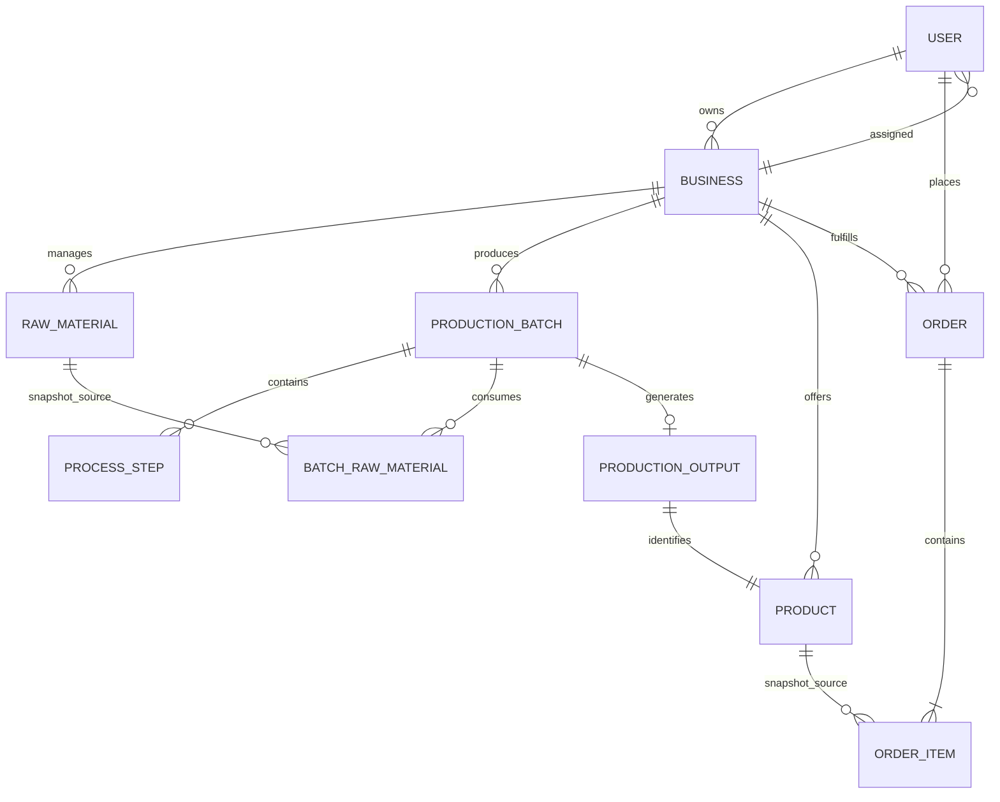

# 05 — Modeli, relacije i podaci

[Sadržaj specifikacije](README.md) · [Tačna Rust polja](13-katalog-tipova.md)

## 1. Tri nivoa modela

1. **Persistence model** predstavlja red SQL tabele, npr. Product i OrderItem.
2. **DTO** definiše zahtev ili odgovor, npr. CreateOrderRequest i ProductionBatchResponse. Ne mora imati ista polja ili iste numeričke tipove kao tabela.
3. **Integracioni/read model** predstavlja JSON snapshot i metapodatke isporuke. Projekcija nije novi autoritativni vlasnik poslovnog entiteta.

SQL migracije su konačan izvor tipova, default-a i ograničenja. Rust `Option` pokazuje mogućnost odsustva u strukturi, ali ne zamenjuje proveru SQL nullability ili poslovnih pravila.

## 2. Logičke relacije

Ovo je **logički** dijagram. Nisu sve linije fizički strani ključevi: reference na drugu servisnu bazu su UUID vrednosti bez FK-a. Veza USER→BUSINESS prikazuje SQL mogućnost više firmi po vlasniku; poslovni servis pokušava da je ograniči na jednu. `production_outputs` nameće najviše jedan automatski proizvod po seriji, ali sam `products.batch_id` nije UNIQUE za stare ili direktno upisane podatke.

## 3. Auth baza

### users

| Polja | Tip / značenje |
|---|---|
| `id` | UUID PK, podrazumevano generisan |
| `email` | Obavezan TEXT, UNIQUE; tačno poređenje u postojećim upitima |
| `password_hash` | Obavezan TEXT; Argon2 reprezentacija; izostavljen iz JSON odgovora |
| `role` | Obavezan TEXT, default CUSTOMER; nema SQL CHECK liste u početnoj šemi |
| `business_id` | Opcioni UUID; nije deklarisan FK prema businesses |
| `first_name`, `last_name`, `address` | Obavezni profilni TEXT podaci |
| `phone`, `photo_url` | Opcioni TEXT |
| `date_of_birth` | Opcioni DATE |
| `created_at`, `updated_at` | TIMESTAMPTZ, default now; update trigger |

Indeksi postoje za email i business_id. Email UNIQUE već pravi indeks, pa dodatni email indeks predstavlja dupliranje iste osnovne potrebe.

### businesses

`id UUID PK`; `name TEXT NOT NULL`; `owner_id UUID NOT NULL REFERENCES users(id) ON DELETE CASCADE`; `address TEXT NOT NULL`; opcioni `phone`, `description`, `website`; `created_at` i `updated_at` TIMESTAMPTZ. Postoji indeks owner-a, bez UNIQUE `owner_id` ograničenja. Brisanje vlasnika može kaskadno obrisati firmu u auth bazi; to nije kaskada kroz ostale servise.

## 4. Raw Materials baza

### raw_materials

| Polja | Tip / značenje |
|---|---|
| `id`, `business_id` | UUID PK i obavezna tenant referenca |
| `name` | VARCHAR(255), obavezno |
| `material_type` | VARCHAR(100), obavezno |
| `quantity` | NUMERIC(12,3), default 0 |
| `unit` | VARCHAR(50), obavezno |
| `supplier`, `origin` | Opcioni VARCHAR(255) |
| `harvest_date`, `received_date`, `expiry_date` | Opcioni DATE; received_date je dopunska migracija |
| `notes` | Opcioni TEXT |
| `low_stock_threshold` | Opcioni NUMERIC(12,3); null isključuje alarm |
| `is_deleted` | BOOLEAN default false |
| `created_at`, `updated_at` | TIMESTAMP, update trigger |

Indeksi: firma, tip i `(business_id, is_deleted)`. Niska zaliha je količina manja ili jednaka postavljenom pragu. Ne postoji SQL CHECK nenegativnosti količine u početnoj tabeli; neke putanje ga obezbeđuju aplikacionim uslovom, a neke imaju slabiju validaciju.

### production_consumption

`operation_id UUID PK`; `business_id UUID`; `raw_material_id UUID REFERENCES raw_materials(id)`; `quantity NUMERIC(12,3) CHECK(quantity > 0)`; `unit VARCHAR(50)`; `released BOOLEAN DEFAULT false`. Sva polja osim default vrednosti su obavezna. Operation ID je identitet poslovnog pokušaja utroška; nije ID HTTP zahteva ili korisnika.

Nema timestamp-a ni batch_id kolone. Veza prema batch materijalu ostvarena je dogovorom da je `batch_raw_materials.id` jednak `operation_id`. Ta veza nije FK preko baza.

### consumption_tombstones

`operation_id UUID PK`, `business_id UUID NOT NULL`, `created_at TIMESTAMPTZ`. Release upisuje tombstone pre vraćanja količine. Kasni consume istog ID-a se odbija i ne može ponovo umanjiti zalihu.

## 5. Productions baza

### production_batches

Osnovna polja: `id UUID PK`, `business_id UUID`, `name VARCHAR(255)`, `process_type VARCHAR(100)`, opcioni `start_date DATE`, `end_date DATE`, `notes TEXT`, `status VARCHAR(20)` default PLANNED sa CHECK skupom statusa, `is_deleted BOOLEAN`, `created_at/updated_at TIMESTAMP`.

Izlazna polja iz dodatne migracije: opcioni `output_name TEXT`, `output_type TEXT`, `output_unit TEXT`, `output_quantity DOUBLE PRECISION`, `output_expiry_date DATE`. Količina ima CHECK pozitivnosti i konačnosti. Skup podržanih tipova/jedinica proverava servis pri završavanju, ne SQL enum.

### process_steps

`id UUID PK`; `batch_id UUID REFERENCES production_batches(id) ON DELETE CASCADE`; `business_id UUID`; `step_order INT`; `name VARCHAR(255)`; opcioni `description TEXT`, `duration_hours NUMERIC(8,2)`, `temperature NUMERIC(6,2)`; timestamp-i. UNIQUE `(batch_id, step_order)` i indeks batch-a. Temperatura je opisni podatak procesa, ne očitavanje senzora.

### batch_raw_materials

`id UUID PK`; `batch_id` lokalni FK sa cascade; `business_id`; `raw_material_id` udaljena referenca; obavezni `raw_material_name VARCHAR(255)`, `material_type VARCHAR(100)`, `quantity_used NUMERIC(12,3)`, `unit VARCHAR(50)`; opcioni `origin`, `supplier`, `harvest_date`, `received_date`, `expiry_date`.

UNIQUE `(batch_id, raw_material_id)` sprečava dva zapisa iste sirovine u seriji. Poreklo, naziv i datumi su **snapshot pri upotrebi**, ne dinamički join na trenutno stanje sirovine. U detalj DTO-u polje `id` sirovine predstavlja `raw_material_id`, dok interni ID veze ostaje zaseban.

### material_intents i material_release_jobs

Obe tabele koriste `operation_id UUID PK`, `business_id`, `created_at` i opcioni `completed_at`. Intent se nezavisno commit-uje pre udaljenog consume poziva. Release job nastaje pri uklanjanju veze, otkazivanju ili brisanju serije. Recovery obrađuje nezavršene redove idempotentno.

Trigger nad `process_steps` i `batch_raw_materials` zaključava roditeljski batch i odbija promenu ako je `COMPLETED`, `CANCELLED` ili obrisan. Trigger nad batch-em zabranjuje promenu završenog zapisa i kreira release poslove.

## 6. Products baza

### products

| Polja | Tip / značenje |
|---|---|
| `id`, `business_id` | UUID PK i tenant |
| `name`, `product_type` | VARCHAR(255) / VARCHAR(100), obavezno |
| `description` | Opcioni TEXT |
| `quantity`, `unit` | NUMERIC(12,3) i VARCHAR(50) |
| `price` | NUMERIC(12,2) |
| `batch_id` | Opcioni UUID udaljene proizvodne serije |
| `expiry_date` | Opcioni DATE iz dopunske migracije |
| `image_path`, `qr_path` | Opcione relativne VARCHAR(500) putanje |
| `qr_token` | UUID NOT NULL UNIQUE, nezavisan od product ID-a |
| `is_active` | BOOLEAN; poslednja migracija menja default sa true na false |
| `is_deleted` | BOOLEAN default false |
| `created_at`, `updated_at` | TIMESTAMP, update trigger |

Indeksi: firma, tip, `(business_id, is_active, is_deleted)`, QR. `is_active` u API odgovoru može biti efektivna vrednost izračunata zajedno sa `production_states`, a ne samo fizička kolona.

### production_outputs

`batch_id UUID PRIMARY KEY`, `product_id UUID NOT NULL UNIQUE REFERENCES products(id)`. Ovo je ledger automatski kreiranog proizvodnog izlaza. Istovremeno daje dokaz da je količina nastala merenjem proizvodnje i da je obična izmena ne sme zameniti.

### production_states

`batch_id UUID PRIMARY KEY`, `business_id UUID`, `status TEXT`, `sequence BIGINT`, `deleted BOOLEAN DEFAULT false`. Ovo je lokalna kopija statusa serije ažurirana događajima. Output consumer proverava sekvencu pod istim transakcionim advisory lock-om pre promene statusa ili kreiranja izlaza.

### stock_reservations i stock_reservation_items

`stock_reservations` ima `id UUID PK`, kanonski JSON payload i vreme nastanka. Stavke imaju složeni ključ `(reservation_id, product_id)`, FK prema rezervaciji/proizvodu, `business_id`, pozitivnu `NUMERIC(12,3)` količinu i `released`. Jedan transaction zaključava operaciju i uslovno umanjuje sve proizvode; konflikt vraća ceo transaction.

## 7. Orders baza

### orders

`id UUID PK`, `business_id UUID NOT NULL`, opcioni `customer_id UUID`, `customer_name/customer_email VARCHAR(255)`, `status VARCHAR(20)` default PENDING sa CHECK skupom, `total_price NUMERIC(12,2)` default 0, `notes TEXT`, `is_deleted BOOLEAN`, `created_at/updated_at TIMESTAMP`.

SQL dozvoljava null customer_id radi anonimne prodaje u početnom dizajnu, ali aktivan HTTP create prima samo CUSTOMER i servis upisuje ID. To nije implementirana walk-in prodajna funkcija. Indeksi pokrivaju firmu, kupca, status po firmi i datum po firmi.

### order_items

`id UUID PK`; `order_id UUID REFERENCES orders(id) ON DELETE CASCADE`; `product_id UUID` bez udaljenog FK-a; snapshot `product_name VARCHAR(255)`, `product_type VARCHAR(100)`, `unit_price NUMERIC(12,2)`, `quantity NUMERIC(12,3)`, `unit VARCHAR(50)`; `subtotal NUMERIC(12,2) GENERATED ALWAYS AS (unit_price * quantity) STORED`.

Promena imena ili cene proizvoda ne menja staru stavku. Nema posebne tabele Customer: identitet pripada auth domenu, a kontakt na porudžbini je snimak. Nema polja currency, payment_id, paid_at ili shipped_at.

### checkout_jobs

`id UUID PK` je HTTP `Idempotency-Key`; tabela čuva `customer_id`, originalni request, server-side payload sa snapshot-om proizvoda, status `PENDING|COMPLETED|FAILED`, odgovor/grešku i vremena. Isti ključ može da se ponovi samo sa istim kupcem i request JSON-om.

### order_stock_links i stock_release_jobs

Veza mapira nastalu porudžbinu na checkout rezervaciju i firmu. Release job ima `order_id PK`, checkout/business i `completed_at`; upisuje se u istoj transakciji kao otkazivanje ili dozvoljeno brisanje porudžbine.

## 8. Integracione tabele

### integration_outbox — u svakoj od pet domenskih baza

`sequence BIGSERIAL PK`, `entity_type TEXT`, `entity_id UUID`, `operation TEXT CHECK INSERT/UPDATE/DELETE`, `data JSONB`, `occurred_at TIMESTAMPTZ DEFAULT now()`, opcioni `published_at TIMESTAMPTZ`. Parcijalni indeks pokriva `published_at IS NULL`.

Broj sekvence je lokalni za izvor, ne globalni sat. PostgreSQL sequence ne garantuje odsustvo rupa. Poruka dodaje source i schema_version; occurred_at nije trenutno deo AMQP envelope-a.

### projection_entities — read_models_db

Složeni PK `(source, entity_type, entity_id)`; `sequence BIGINT`, `deleted BOOLEAN`, `data JSONB`, `projected_at TIMESTAMPTZ`. Indeksi po JSON business_id, customer_id, batch_id i qr_token ubrzavaju najvažnije pretrage. Deleted red se zadržava radi odbacivanja zakasnelog starog stanja.

### projection_receipts — read_models_db

Složeni PK `(source, sequence)` i `applied_at TIMESTAMPTZ`. Evidentira obrađenu dostavu i sprečava duplu primenu. Receipts nisu korisnički audit log: ne sadrže pouzdano ko je izvršio poslovnu akciju, razlog, IP ili correlation ID.

## 9. Brisanje i istorija

Sirovine, serije, proizvodi i porudžbine uglavnom koriste `is_deleted`. Koraci i veze sirovina brišu se fizički kroz odgovarajuće repozitorijume; korisnici i firme takođe imaju fizičko brisanje. Soft-delete roditelja nije SQL DELETE i sam po sebi ne pokreće `ON DELETE CASCADE` nad njegovom decom.

Integracioni trigger obuhvata fizički DELETE i UPDATE soft-delete zastavice. Read-model tretira oba kao deleted stanje. Ne treba fizički čistiti tombstone i receipts bez definisane replay/retention politike.

## 10. Promena ugovora

Dodavanje kolone obično zahteva migraciju, Rust model/DTO, SQL upite, `.sqlx` metapodatke, frontend model i eventualno renderer/projekciju. `Option<T>` update sa `.or(existing)` uglavnom ne razlikuje „nije poslato“ i „želim null“, pa mnoga opciona polja nije moguće obrisati slanjem null. Za preciznu PATCH semantiku potreban je trostruki model odsutno/null/vrednost.
### checkout_jobs

`id UUID PK` je HTTP `Idempotency-Key`; tabela čuva `customer_id`, originalni request, server-side payload sa snapshot-om proizvoda, status `PENDING|COMPLETED|FAILED`, odgovor/grešku i vremena. Isti ključ se može replay-ovati samo sa istim kupcem i request JSON-om.

### order_stock_links i stock_release_jobs

Veza mapira svaku nastalu porudžbinu na checkout rezervaciju i firmu. Release job ima `order_id PK`, checkout/business i `completed_at`; upisuje se u istoj transakciji kao otkazivanje ili dozvoljeno brisanje porudžbine.
