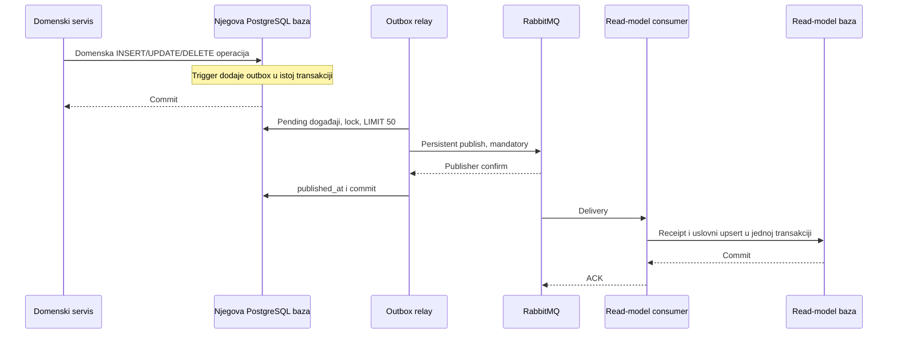
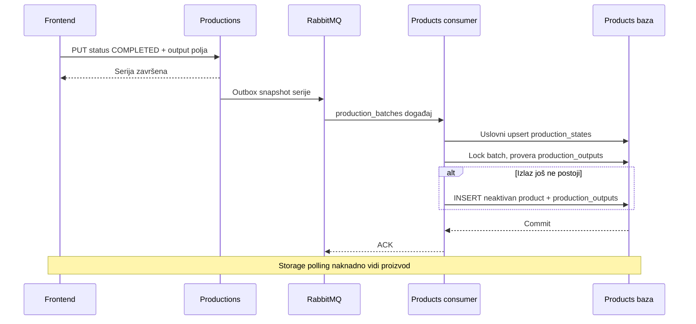
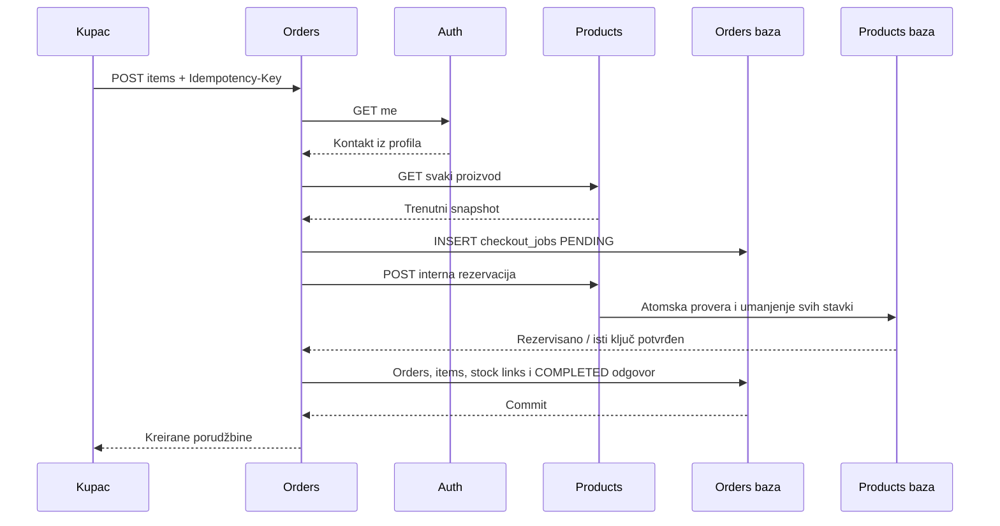

# 07 — Povezanost servisa, događaji i tokovi

[Sadržaj specifikacije](README.md)

## 1. Matrica sinhronih zavisnosti

| Pozivalac | Odredište | Razlog | Autentifikacija |
|---|---|---|---|
| Productions | Raw Materials GET | Postojanje, farma, jedinica i snapshot sirovine | Prosleđen korisnički JWT |
| Productions | Raw Materials consumption/release | Umanjenje ili kompenzacija ulazne zalihe | `MATERIAL_STOCK`, farm scope |
| Products | Productions trace | Provera završene serije pre aktiviranja | T token, sub=batch ID |
| Products | Read Models provenance | Objedinjeni podaci porekla | T token, sub=product ID |
| Orders | Auth `/me` | Pouzdano ime i email prijavljenog naloga | Kupčev JWT |
| Orders | Products GET | Cena, raspoloživost, farma i ime proizvoda | Kupčev JWT |
| Orders | Products reservation/release | Atomska rezervacija ili povraćaj prodajne zalihe | `ORDER_STOCK`, operation/farm scope |
| Frontend | Auth `/me` | Usklađivanje korisničkog profila i novog tokena | Sesijski JWT |

Helper `fetch_farm_name` i auth trace endpoint postoje, ali glavni `ProvenanceService.build` koristi read-models. Ne treba crtati direktan auth→provenance fan-out kao aktivni put javnog skeniranja.

## 2. Format integracionog događaja

```json
{
  "schema_version": 1,
  "source": "productions",
  "sequence": 123,
  "entity_type": "production_batches",
  "entity_id": "11111111-1111-4111-8111-111111111111",
  "operation": "UPDATE",
  "data": {"id":"11111111-1111-4111-8111-111111111111","status":"COMPLETED"}
}
```

`data` ovde prikazuje samo ilustrativni deo: stvarna poruka nosi snapshot reda, uz filtriranje određenih privatnih polja. Routing key je `source.entity_type.operation` sa operacijom malim slovima, npr. `productions.production_batches.update`. `message_id` je `source:sequence`.

| Source | Entity tipovi |
|---|---|
| auth | farms, users |
| raw-materials | raw_materials |
| productions | production_batches, process_steps, batch_raw_materials |
| products | products |
| orders | orders, order_items |

Aktuelni događaji su tehnički INSERT/UPDATE/DELETE snapshot-i. Stariji opis `product.created` i exchange bez `.v1` ne opisuje sadašnji publisher. Događaj ne sadrži zasebne actor, correlation_id ili causation_id vrednosti.

## 3. Outbox i projekcija



Relay koristi `pg_try_advisory_xact_lock(7142026)` da u jednoj izvornoj bazi istovremeno objavljuje samo jedna instanca. Pending redove čita redom po sequence i zadržava transakciju tokom slanja. Prazan polling i neuspešno dobijen lock čekaju 500 ms; neuspešna konekcija dovodi do pokušaja posle tri sekunde.

Ako broker prihvati poruku, ali relay ne potvrdi upis `published_at`, ista poruka stiže ponovo. Read model to prihvata: receipt `(source,sequence)` je UNIQUE, a upsert ažurira entitet samo ako je nova sequence veća. DELETE i soft-delete ostavljaju tombstone da kasniji stari INSERT ne oživi entitet.

AMQP potvrda nije potvrda da je projekcija već obrađena. Trajan exchange/red/poruka i Docker volume štite od određenih restart scenarija; nisu zamena za broker replikaciju ili backup.

## 4. Poseban consumer proizvodnog izlaza



Consumer ima poseban durable red, pa ne oduzima događaj read-model potrošaču. Njegov QoS je 10, a projekcionog 50. Pre primene validira envelope i output. Trajno loša poruka potvrđeno se objavljuje u `local_bite.production_outputs.dead.v1`, pa se original ACK-uje. Greška baze radi NACK/requeue i reconnect. Sequence se proverava pre kreiranja izlaza, pa stariji completed ne oživljava novije obrisanu seriju.

## 5. Proizvodni utrošak i kompenzacija

Productions pre udaljenog poziva nezavisno commit-uje `material_intents`, dok lokalna transakcija drži advisory lock iste operacije. Posle pada recovery dobija lock, proverava da li je lokalna veza nastala i po potrebi poziva idempotentni release. Uklanjanje veze, otkazivanje i brisanje serije trigger-om stvaraju `material_release_jobs`.

Raw Materials prvo upisuje release tombstone, pa kasni consume iste operacije ne može ponovo da potroši stanje. Recovery traje dok zavisni servis ponovo ne postane dostupan; to je eventualna kompenzacija, ne globalni commit.

## 6. Porudžbina i skidanje stanja



Ako Orders padne posle udaljenog commit-a, `checkout_jobs` ostaje PENDING. Recovery ponavlja identičnu rezervaciju i završava lokalni upis. Otkazivanje stvara trajni release posao. Frontend zadržava isti ključ za isti kupac+telo posle neizvesnog mrežnog ishoda, uključujući reload stranice.

## 7. Čitanje porekla

QR API kombinuje aktuelni proizvod iz write baze sa projektovanim podacima drugih domena. Ako se batch_id proizvoda u projekciji razlikuje od aktuelnog, vraća 409. Read model ne kontaktira izvorne servise pri čitanju, pa ranije projektovan lanac može da se čita i tokom njihovog prekida.

Projekcije različitih entiteta stižu odvojeno. Nema globalnog atomskog snapshot-a preko svih publisher-a: moguće je da je proizvod stigao, a farma ili neki korak još nije. `asOf` ne rešava ovu semantičku kompletnost.

## 8. Matrica kvarova

| Kvar | Očekivano ponašanje iz koda | Ograničenje |
|---|---|---|
| Broker nedostupan | Domenski upis može uspeti; outbox čeka | Novi output i projekcije kasne |
| Read DB nedostupna | Consumer requeue/reconnect; query ne uspeva | Write servisi mogu nastaviti |
| Dupli projekcioni događaj | Receipt sprečava ponovnu primenu | Važi za ovaj consumer, ne proizvoljan novi consumer |
| Stariji projekcioni događaj | Uslovni upsert ga ne primenjuje | Nema globalnog poretka između izvora |
| Loš projekcioni envelope | Dead-letter | Potrebna ručna inspekcija i korekcija |
| Products nije dostupan pre rezervacije | Checkout ostaje PENDING; isti ključ se ponavlja | Klijent mora sačuvati isti ključ |
| Orders padne posle rezervacije | Recovery završava checkout iz trajne namere | Eventualno, po dostupnosti servisa |
| Cancel release ne uspe | `stock_release_jobs` ostaje pending i ponavlja se | Health `ok` sam ne prikazuje backlog |
| Proizvodni consumer dobije trajno lošu poruku | Potvrđeni publish u output DLQ; red nastavlja | Potrebna inspekcija DLQ-a |
| Upload upisan, SQL putanja nije | Delimičan filesystem/DB ishod | Nema file transaction ili cleanup job-a |

## 9. Replay i evolucija

Migracije outbox-a šalju početne INSERT snapshot-e već postojećih podataka. `Replay-Events.ps1` poništava published_at već poslatih redova i omogućava ponovno emitovanje. Read-model receipt/tombstone logika je projektovana za duplikate i stare poruke.

Replay obrađuju svi aktivni pretplatnici, uključujući products output consumer. Oporavak produkcione zalihe zato treba posmatrati odvojeno od rekonstrukcije read baze. Ne menjati `schema_version` bez koordinisane podrške svih potrošača i plana kompatibilnosti. Novi nezavisni consumer dobija svoj red; dva procesa na istom redu dele posao umesto da svaki dobije sve poruke.
